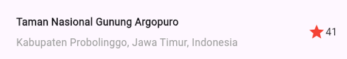

# layout_flutter

A new Flutter project.

# 🌄 Praktikum Flutter Layout 1–4

**Nama:** Satrio Wisnu Adi Pratama  
**NIM:** 2341720219  
**Kelas:** D4 Teknik Informatika

---

## 📘 Deskripsi

Proyek ini merupakan hasil dari **Praktikum Flutter Layout** pertemuan 1 sampai 4.  
Aplikasi menampilkan tampilan wisata **Gunung Argopuro** dengan komponen:

- Gambar utama
- Nama tempat, lokasi, dan rating
- Tiga tombol aksi (`Call`, `Route`, `Share`)
- Deskripsi teks di bagian bawah

---

## 🧩 Praktikum 1 – Title Section

Membuat bagian **judul (title section)** yang menampilkan nama tempat, lokasi, dan rating.  
Widget yang digunakan antara lain:

- `Row` untuk menyusun elemen secara horizontal
- `Column` untuk teks berbaris dua
- `Expanded` agar kolom teks menyesuaikan ruang yang tersedia
- `Icon` untuk menampilkan bintang dengan warna merah

**Hasil Screenshot:**  

---

## 🧩 Praktikum 2 – Button Section

Menambahkan **tiga tombol aksi** (`CALL`, `ROUTE`, `SHARE`) yang ditampilkan secara horizontal menggunakan `Row`.  
Setiap tombol dibangun menggunakan fungsi `_buildButtonColumn()` yang terdiri dari:

- `Icon` dengan warna utama aplikasi
- `Text` sebagai label tombol di bawah ikon

**Hasil Screenshot:**  

---

## 🧩 Praktikum 3 – Text Section

Menambahkan bagian **deskripsi teks** di bawah tombol menggunakan `Container` dengan padding.  
Properti `softWrap: true` digunakan agar teks otomatis pindah baris sesuai lebar layar.

**Hasil Screenshot:**  

---

## 🧩 Praktikum 4 – ListView

Menggabungkan seluruh komponen (`Image`, `titleSection`, `buttonSection`, `textSection`) ke dalam widget `ListView`.  
`ListView` memungkinkan tampilan untuk **di-scroll secara vertikal** saat konten melebihi tinggi layar.

**Hasil Screenshot:**  

---

## 🏔️ Deskripsi Wisata

> **Gunung Argopuro** adalah salah satu gunung di Jawa Timur yang terkenal dengan jalur pendakian terpanjang di Pulau Jawa.  
> Dikenal dengan pemandangan sabana yang luas dan keindahan **Danau Taman Hidup**.
>
> **Dikerjakan oleh:** Satrio Wisnu Adi Pratama (2341720219)

---

## Getting Started

This project is a starting point for a Flutter application.

A few resources to get you started if this is your first Flutter project:

- [Lab: Write your first Flutter app](https://docs.flutter.dev/get-started/codelab)
- [Cookbook: Useful Flutter samples](https://docs.flutter.dev/cookbook)

For help getting started with Flutter development, view the
[online documentation](https://docs.flutter.dev/), which offers tutorials,
samples, guidance on mobile development, and a full API reference.
